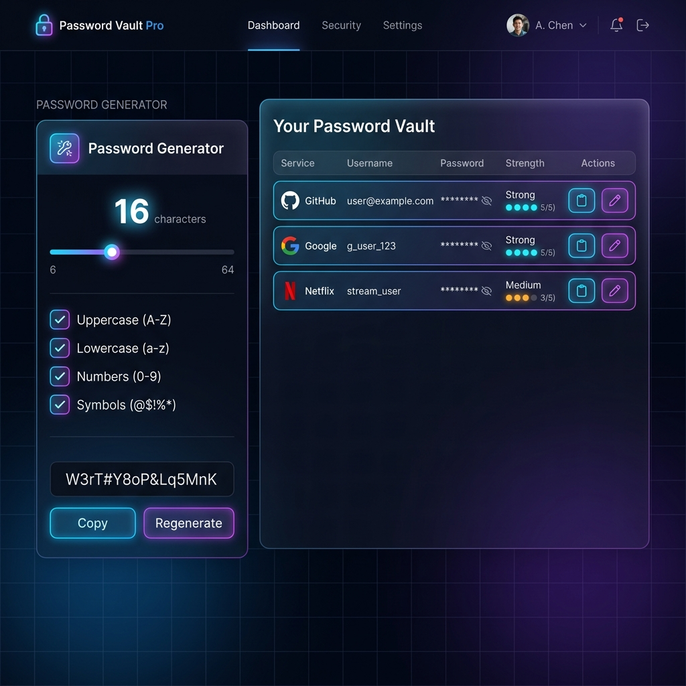

# 🔐 Password Vault Pro

An advanced and secure Password Generator and local Vault application built with **Node.js, Express, and Vanilla CSS**. This app offers a modern glassmorphic interface, a customizable Password/Passphrase Generator, secure local vault storage, theme options, and full PWA support.



---

## ✨ Features

- **Custom Password Generator:** Generate strong passwords with adjustable length (4-64 characters) and toggleable character sets (uppercase, lowercase, numbers, symbols). Displays real-time entropy calculation.
- **Passphrase Generator:** Generate easy-to-remember but highly secure passphrases using randomly selected words.
- **Secure Password Vault:** Save your generated passwords or enter custom credentials to keep them safe locally. Includes strength indicators and copy buttons.
- **Modern UI:** Built with sleek glassmorphism panels, glowing color gradients, and micro-interactions.
- **Responsive Theme Switcher:** Seamlessly switch between custom dark and light themes.
- **Progressive Web App (PWA):** Installs directly onto your device with offline support.

---

## 🚀 Running Locally

### Prerequisites
Make sure you have [Node.js](https://nodejs.org/) (v18+) installed on your machine.

### Installation
1. Clone this repository (or copy the folder).
2. Install the dependencies:
   ```bash
   npm install
   ```

### Starting the Server
Start the development server with:
```bash
npm start
```
The application will boot up at:
👉 **[http://localhost:3000](http://localhost:3000)**

---

## 🛠️ Tech Stack
- **Backend:** Node.js, Express
- **Frontend:** HTML5, CSS3 (Vanilla), JavaScript
- **PWA Capabilities:** Service Workers, Web App Manifest
- **Icons & Styling:** Bootstrap 5 (for structure), Custom Glassmorphic CSS
